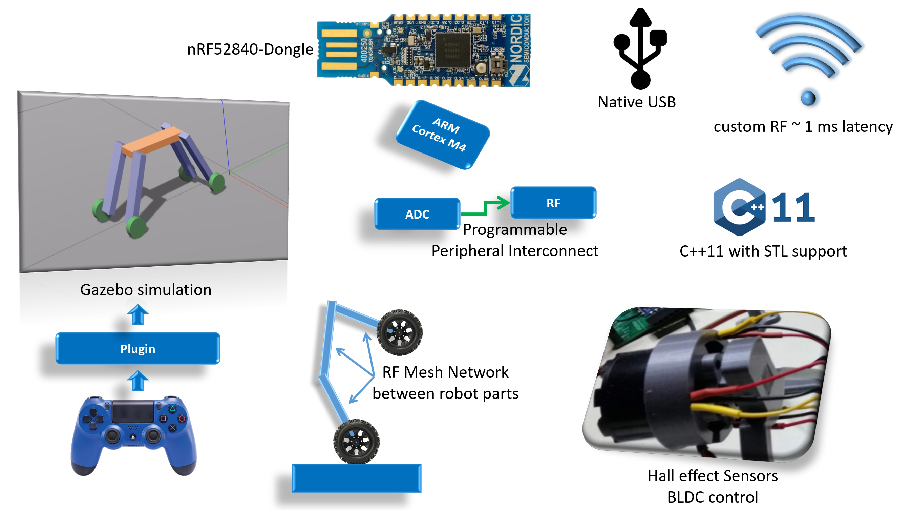
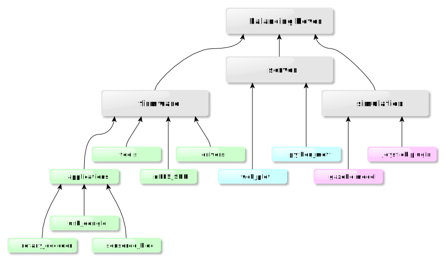

# Description
Open source hobby project to create a robot with an original structure that moves in a home environment.
The robot structure is a double sided inverted pendulum, with the ability to stand up switching from flat mode (car) to the standing mode (balancing robot), on each of its sides. Further dynamic behaviors to be expected. 

# Concept

* A gazebo simulation approximates the robot's physics and allows the user to control it with a joystick to have a feeling of the robot's power depending on the weight and motors power.
* nRF52840 Allows high throughput log with native usb uspport.
* A custom RF protocol allows 1 ms order of magnitude for mesh network communication between the different robots part.
* The Programmable peripheral Interconnect feature of the nRF family is leveraged to increase real time responsiveness of events. This is like having a small FPGA interconnect inside of a powerful micro controller.
* C++ drivers wrappers and Standard library support.

# Requirements
* The robot shall have a body and 4 limbs.
* Each limb shall have a motorized joint connecting it to the body.
* Each limb shall have a motorized wheel.
* In flat mode, the robot shall be able to move like a tank.
* The robot shall be able to go from flat mode to standing mode.
* The robot shall be able to keep balance and move in standing mode.
* All articulations shall be reversible, to allow force control loop (smooth interactive reaction).

# Repository structure

Gray boxes are git repositories / submodules with html links

